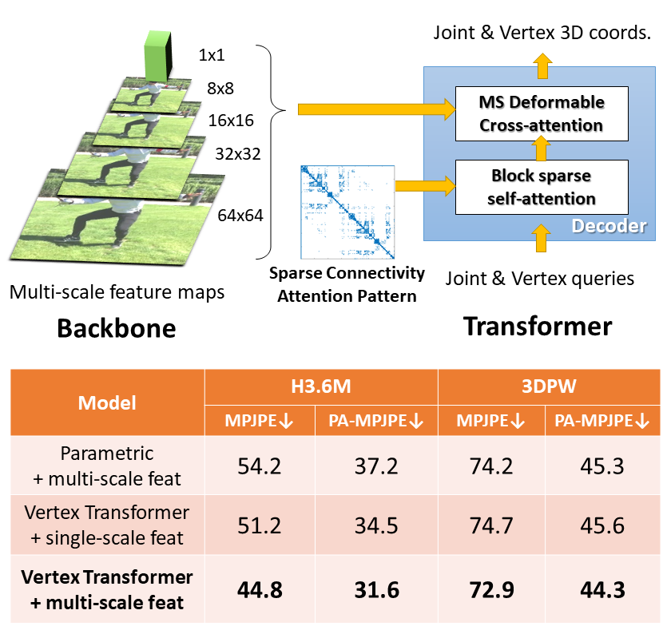
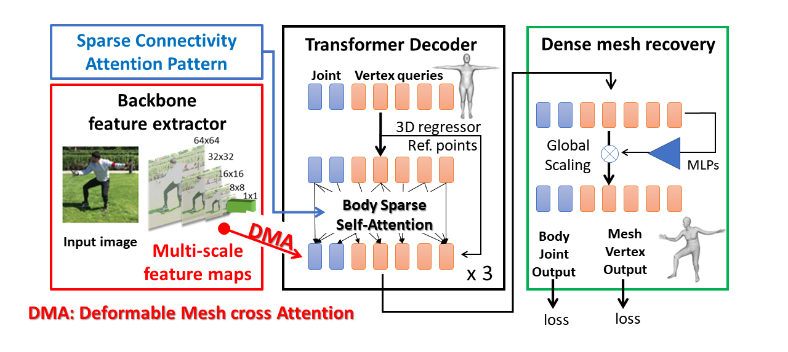
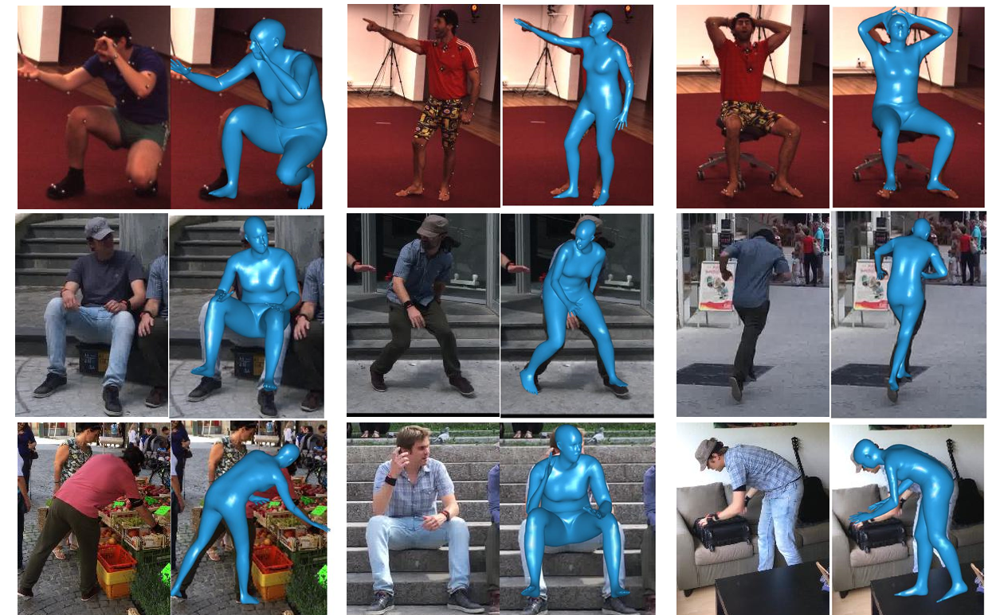

# DeFormer: Deformable mesh transFormer 

This is our research code of DeFormer. We will make it available soon.

[Deformable mesh transformer for 3D human mesh recovery](https://openaccess.thecvf.com/content/CVPR2023/html/Yoshiyasu_Deformable_Mesh_Transformer_for_3D_Human_Mesh_Recovery_CVPR_2023_paper.html
)

DeFormer is a new transformer-based approach to 3D human mesh recovery from a single image. 
In this work, we design a decoder-only mesh transformer with memory-efficient attention modules.
DeFormer's self-attention patterns are sparsified according to body mesh/skeleton connectivity. 
We also design Deformable Mesh cross Attention (DMA) that efficiently aggregates multi-scale image feature maps at each vertex of the current reconstructed mesh.
<p align="center">



</p>

## Installation
Check [INSTALL.md](docs/INSTALL.md) for installation instructions.

## Model and Download
Please download our pre-trained models and other relevant files that are important to run our code. 

Check [DOWNLOAD.md](docs/DOWNLOAD.md) for details. 

## Experiments
We provide python codes for training and evaluation. (Right now, the option for using sparse self-attention is not available.)

Check [EXP.md](docs/EXP.md) for details.


## License

Our research code is released under the MIT license. Deformable attention related codes are released under Apach 2.0.
See [LICENSE](LICENSE) for details.

We use submodules from third parties, such as Deepspeed

Our models have dependency with SMPL models. Please note that any use of SMPL models and MANO models are subject to **Software Copyright License for non-commercial scientific research purposes**. Please see [SMPL-Model License](https://smpl.is.tue.mpg.de/modellicense) and [MANO License](https://mano.is.tue.mpg.de/license) for details.


## Citations
If you find our work useful in your research, please consider citing:

```bibtex
@inproceedings{yoshiyasu2023-deformer,
author = {Yoshiyasu, Yusuke},
title = {Deformable mesh transformer for 3D human mesh recovery},
booktitle = {CVPR},
year = {2023},
pages     = {17006-17015}
}
```


## Acknowledgments

Our implementation and experiments are built on top of open-source GitHub repositories. We thank all the authors who made their code public.

[Mesh transformer](https://github.com/microsoft/MeshTransformer)  
[Mesh Graphormer](https://github.com/microsoft/MeshTransformer)  
[Deformable Detr](https://github.com/fundamentalvision/Deformable-DETR)  
[HRNet](https://github.com/HRNet/HRNet-Human-Pose-Estimation)  
[Aggpose](https://github.com/PediaMedAI/AggPose)  
[MMpose](https://github.com/open-mmlab/mmpose)  
[Deepspeed](https://github.com/microsoft/DeepSpeed)  
[Pymaf](https://github.com/HongwenZhang/PyMAF)
